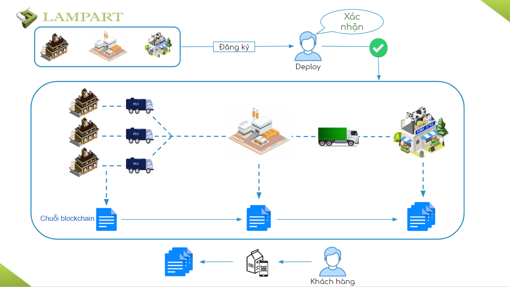
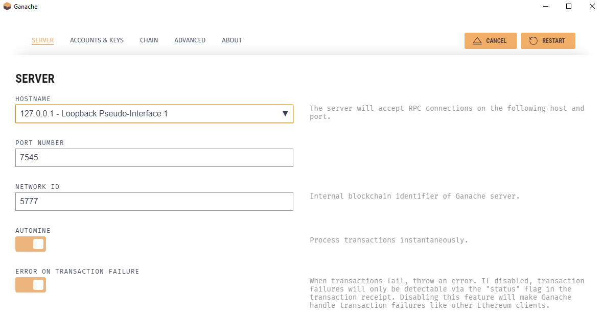

## DỰ ÁN CHUỖI CUNG ỨNG SỮA



Chuỗi cung ứng sữa giúp chúng ta(người sử dụng) biết chính xác sản phẩm sản xuất ở trang trại nào thuộc giống bò nào, ngày lấy sữa và thành phần bổ sung đối với từng loại sữa ở nhà máy nào. Tránh được tình trạng hàng dã hàng nhái trên thị trường.

Dự án được phát triển tại công ty [Lampart Co.Ltd](https://lampart-vn.com/).

---

## Cần setup trước
- Cài truffle
- Cài Ganache
- Cài MetaMask (Setup RPC Provider kết nối với Ganache)

---

## Cài đặt

Windows.

1. Chạy lệnh cmd để cài đặt **node_modules** <br/>
   `npm install`
2. Chạy lệnh sau để test build các file **.sol** trong thư mục contracts <br/>
   `npm compile`
3. Tiến hành mở Ganache (có thể mở Ganache bằng lệnh cmd hoặc mở Ganache GUI). Nếu mở bằng ứng dụng Ganache GUI chúng ta vào phần cài đặt của Ganache và setup **host**, **port number** và **network_id** cho trùng với file **truffle-config.js**<br/>
    
    ```
    development: {
        host: "127.0.0.1",
        port: 7545,
        network_id: "5777" // Match any network id
    },
    ```
4. Tiến hành chạy lệnh<br/>
   `truffle migrate --reset`
5. Tiến hành start server node để test ứng dụng<br/>
   `npm run dev`
---